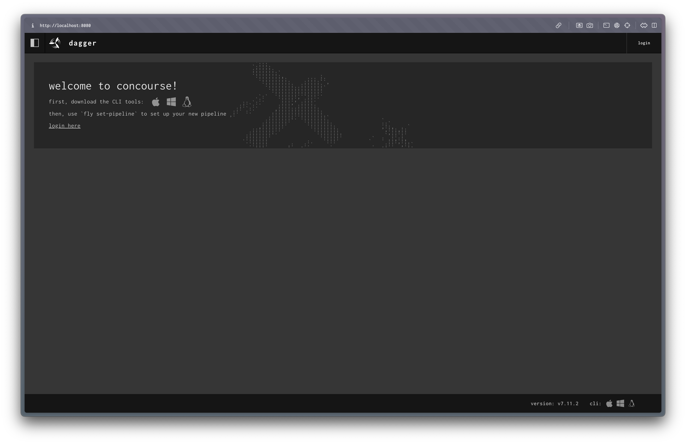
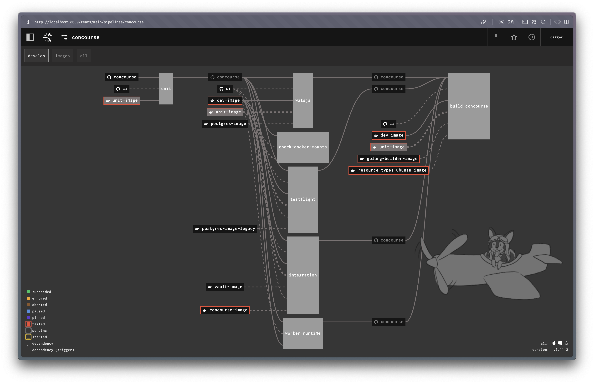

## Assumptions
- Docker is running locally
- OS is macOS

> **Note**
> Tested on macOS `12.7` running Docker Engine `24.0.6`

## How to use this module?

1. From this dir, build a compatible Dagger CLI & Engine:
```sh
cd ../
git submodule init && git submodule update
cd dagger && ./hack/dev
```
2. Check that you are using the correct Dagger CLI & Engine:
```sh
cd ../concourse && direnv allow
dagger version
dagger serve
```
3. Run this module:
```sh
dagger serve concourse.quickstart
```

Concourse Web UI is now available via <http://localhost:8080> 



## How to configure a Concourse pipeline?

1. Download `fly` from <http://localhost:8080/api/v1/cli?arch=amd64&platform=darwin> (bottom right corner)
2. Add the `concourse.yml` pipeline from this directory (requires DockerHub credentials)
```sh
fly login -t dagger -c http://localhost:8080 -u dagger -p dagger

export DOCKER_USERNAME=user
export DOCKER_PASSWORD=pass
fly set-pipeline -c concourse.yml -p concourse -t dagger \
    --var "docker.username=$DOCKER_USERNAME" \
    --var "docker.password=$DOCKER_PASSWORD"

fly unpause-pipeline -p concourse -t dagger
```
3. View this pipeline in the UI <http://localhost:8080/teams/main/pipelines/concourse>
    - Requires login with username `dagger` & password `dagger` <http://localhost:8080/sky/login>

This is what the end-result will look like:


